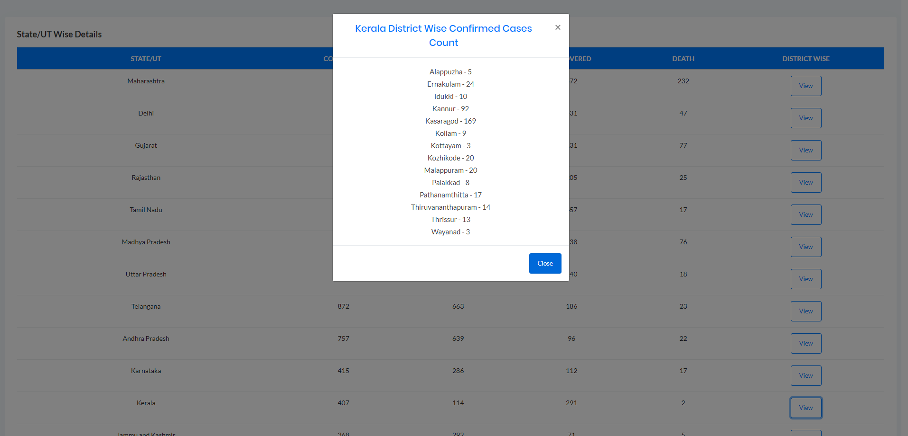

# COVID19-India-Dashboard

Live working demo of the dashboard can be found at https://covid19-india-stat.herokuapp.com/ .

This dashboard is created to get the updated statistics about the COVID-19 disease.

The Dashboard gives us information about the number of confirmed cases, number of active patients, number of recovered patients and the nuber of deceased patients. The users can also know about the statewise, union territory wise and district wise of these details across India. The agewise aftected number of patients can be found here.

All the APIs used to build the dashboard can be found at https://api.covid19india.org/.

